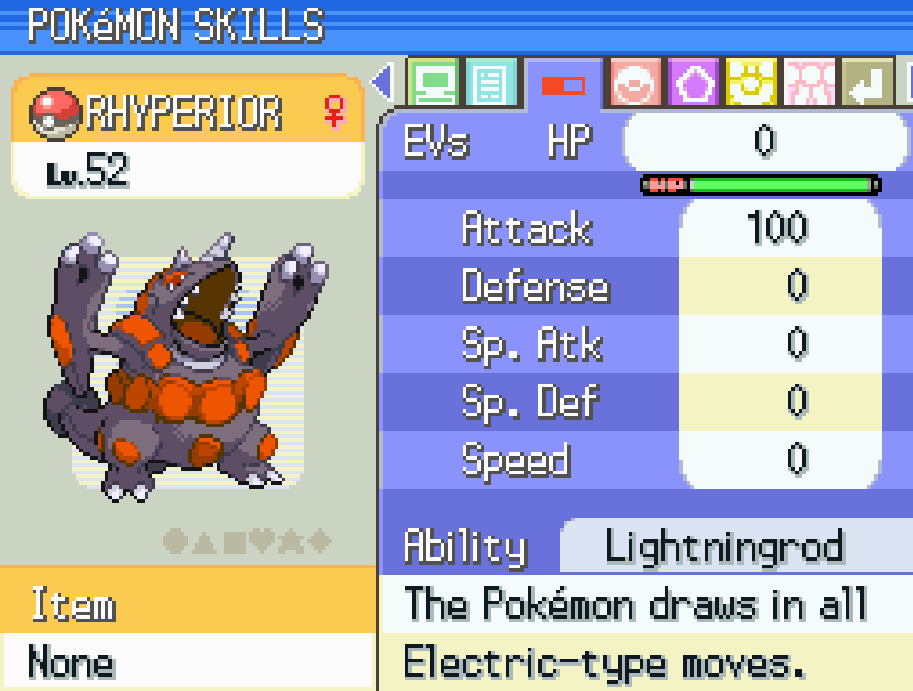
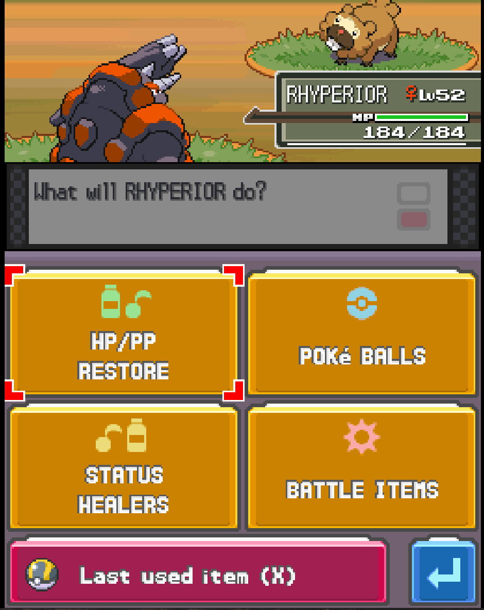

# UI changes
Documentation about all ui changes present in the mod.

## Auto Repel
When the effect of a active repel wears off, if there is at least one repel item of the same kind in the bag, the game asks if you want to reuse the repel. If you press yes a new repel will be used.  

## Move Reminder
The Move Reminder NPC functions were integrated in the pokemon party menu screen. Now if you open your party menu and select a pokemon a new item will be present "LEARN MOVE" that will start the move reminder screen.  
In this page you can re-learn (for free) any move the pokemon automatically learn by level up, up to the current level of the pokemon.  
The change was made to add more choises and less annoyance to the player, that most likely won't travel all the way to the move reminder just to relearn a move (if even has the currency to do so). Also, I believe that if pokemon can understand human speech, they can also remind themselves a move they learned literally 5 hours ago.

## EV IV Checker
Two new pages were added in the pokemon summery screen. You can access them by entering the summery screen, moving on the third page and press R (or L to go back) to view the EV and IV stats.  
The change was made because IVs and EVs are a really important part of the battle system, and I find it unfair that are hidden to the player.  

## Sped Up Health Bar
Health bar animation was significantly sped up in all screens instances. Now it should move at 1 pixel per frame which means that a full HP bar of any pokemon in battle should take only ~2.5 seconds to reach zero. 
The change was made to speed up the game battles, which seems really slow compared to other games of the series.

## Sped Up Bag Menu Navigation
Added features in the item menu navigations for faster movement in the item lists. List wrap around is introduced so that if you move up when you are already at the first item of the list it will restart from the bottom. Also, you can press the buttons R and L to move respectively 5 items down or 5 items up in the list.  
The changes were made to reduce the time spent in the item list searching for a item. A way to speed up the game overall.

## Sped Up Battle Bag Menu Navigation
Added features in the battle item menu navigations for faster movement. 
Now you can press the buttons R and L to move respectively to the next and previous item page. Also, if you press the button 'X' in the battle bag page it will use the last used item.  
The changes were made to reduce the time spent in the item list searching for a item. A way to speed up the game overall.

